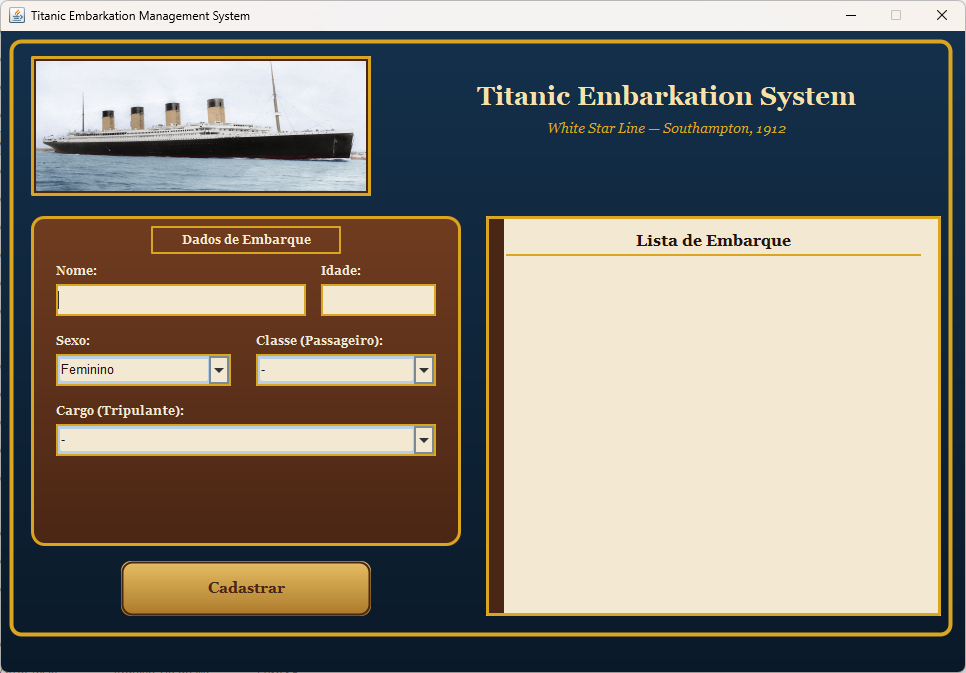

# 🚢 Titanic Survival Simulator & Embarkation System

> Sistema desktop em Java para registro de manifesto e cálculo de probabilidades históricas de sobrevivência no desastre do RMS Titanic (1912).

---

## 📸 Demonstração
<!-- Adicione um print da tela do seu programa aqui -->


---

## ⚓ Sobre o Projeto & Homenagem
Este software foi desenvolvido como um tributo à memória das 2.224 pessoas a bordo do RMS Titanic, unindo conceitos de Programação Orientada a Objetos (POO) e interface visual clássica com dados históricos reais.

### 📊 Base de Dados e Probabilidades
As probabilidades foram baseadas em dados históricos do desastre e fundamentadas no artigo científico:
> 📄 [ACM Digital Library — Titanic Survival Prediction](https://dl.acm.org/doi/abs/10.1145/3220267.3220282)

* **Passageiros:** Probabilidades calculadas por idade (prioridade para menores de 12 anos), sexo e classe social (1ª, 2ª ou 3ª).
* **Tripulantes:** Probabilidades baseadas no sexo e na função exercida a bordo (Capitão, Oficiais, Fogistas, Stewards, etc.).

---

## ✨ Funcionalidades
* Interface gráfica personalizada em Java Swing com estilo de época (Madeira e Pergaminho).
* Validação estrita de campos (bloqueio de caracteres não numéricos na idade e prevenção de seleções conflitantes).
* Registro em tempo real no Diário de Bordo com numeração sequencial.
* Cálculo imediato da probabilidade de sobrevivência ao cadastrar.

---

## 🛠️ Tecnologias Utilizadas
* **Linguagem:** Java 21+
* **Interface Gráfica:** Java Swing / AWT
* **IDE:** Eclipse / VS Code

---

## 🚀 Como Executar

### Pré-requisitos
* Java Runtime Environment (JRE) ou JDK 21 ou superior instalado.

### Executando o arquivo .JAR
1. Baixe o arquivo executável na seção de [Releases](../../releases) ou na raiz do projeto.
2. Dê dois cliques no arquivo `TitanicSystem.jar` ou execute via terminal:
```bash
java -jar TitanicSystem.jar
